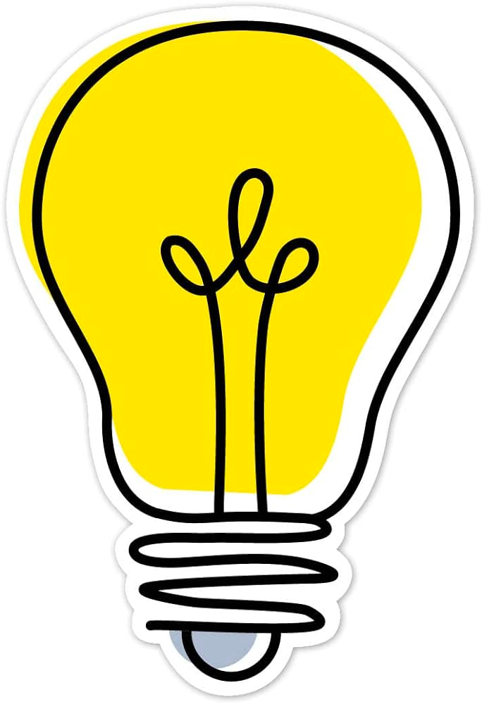

[Next >](docs/intro/01Kiss.md)
# CTRL + ALT + DESIGN - Java 17's Sparks Of Design: Lightbulb states made brilliant

Modelling a lightbulb can be fun and a good opportunity to reflect about heuristics that drive our solutions as well as an opportunity to discuss some features introduced in Java 17.

